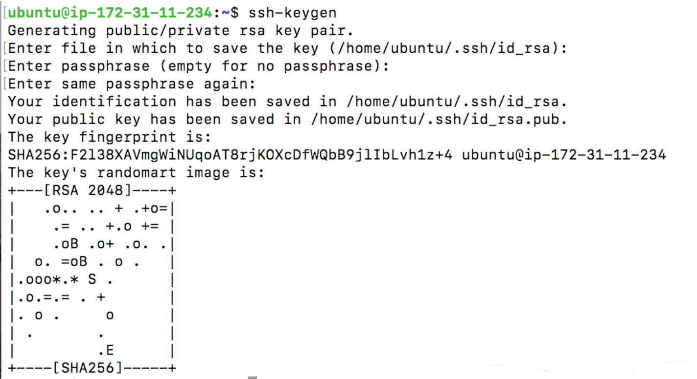

## Before Start

Having some virtual machines (VM) launched on Amazon Web Service (AWS).  

I launched four VMs, you can choose to launch more.  And the Hadoop Version I installed is Hadoop-2.6.5, this configuration works for Hadoop-2.X.X versions.

You can take my blog as an example and configure your VMs.

**Note: recently I noticed that if you keep your Hadoop idling on AWS, AWS may consider the connection between your VMs as DOS Attack and shut down network ports used by Hadoop.**

### Objectives

Build fully distributed Hadoop on the cluster formed by these four VMs.

## SSH Passphrase Free Connection

**For each VM**, type the following command in the terminal to generate a pair of RSA keys (i.e., public key and private key):

`ssh-keygen`

Then press "enter key" for file and passphrase, which means setting these values as default, as shown in the following figure:             

